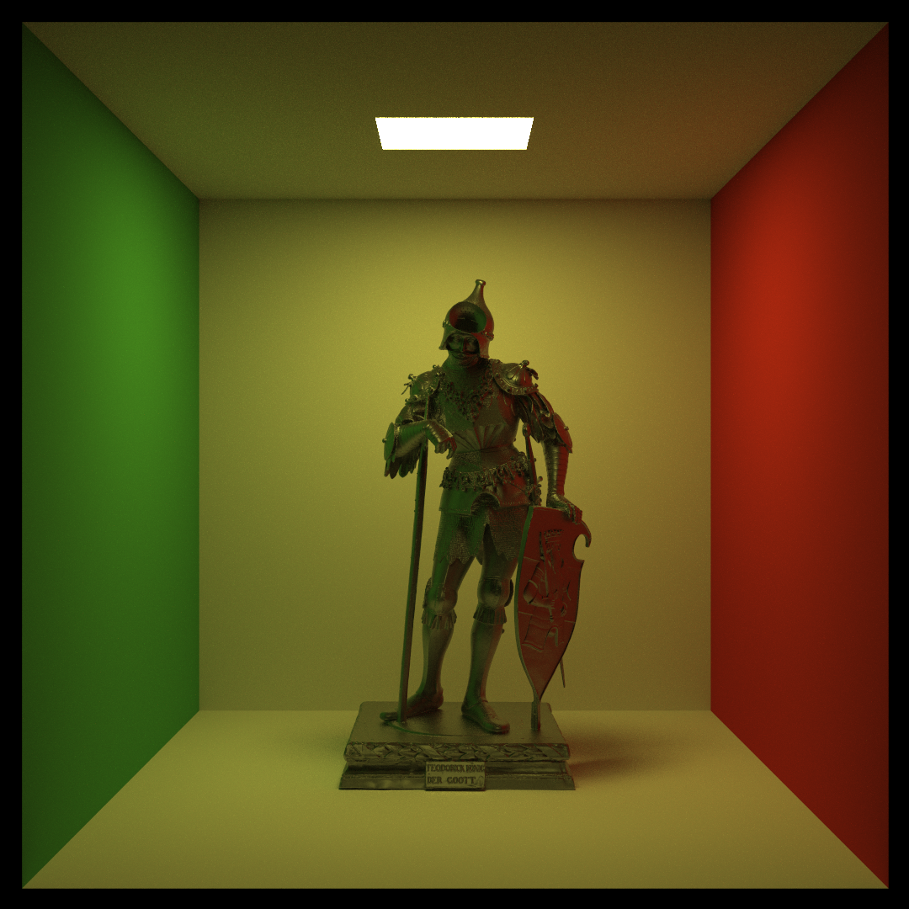

# RustRaytracer

Raytracer written in Rust.

Features:
* Lambertian, specular, and microfaceted materials
* Path tracing with multiple importance sampling

## Examples

Todo list:
* HDR environment maps
* Bidirectional Path Tracing
* Subsurface scattering
* Medium scattering
